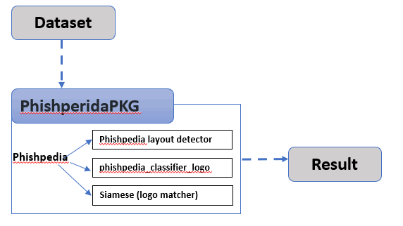

# Phishpedia Package 


#### Introduction

This module is used to package the NUS-Phishperida phishing url  detection project as a black box API for other project to use. Put this module in the same folder of the NUS-Phishperida's 'main' module. NUS-Phishperida link: https://github.com/lindsey98/Phishpedia

###### Program Workflow



Version: v_0.1


------

#### Program Setup

###### Development Environment : Ubuntu 20.04, python 3.8.10-64bit

###### Additional Lib/Software Need: 

**Install torch 1.7 (only for CPU)**

```
pip install torch==1.8.1+cpu torchvision==0.8.2+cpu torchaudio==0.7.2 -f https://download.pytorch.org/whl/torch_stable.html
```

Install torch 1.6 (not use this)

```
pip install torch==1.6.0+cpu torchvision==0.7.0+cpu -f https://download.pytorch.org/whl/torch_stable.html

https://pytorch.org/get-started/previous-versions/
```

**Install Detectron-2 for CPU only** 

use the offical pre-build 

```
pip install detectron2 -f https://dl.fbaipublicfiles.com/detectron2/wheels/cpu/torch1.8/index.html
```

**Install All the lib used by NUS-Phishperida**

Follow this link: https://github.com/lindsey98/Phishpedia


###### Configuration Detail

Config steps file: ***doc/Phishpedia_cfg.md***

------


#### Program Usage

1. [optional] If you don't have Nvidia Graph card enable the CPU mode:

   File: *Phishpedia/src/detectron2_pedia* line 47: 

   ```
   # uncomment if you installed detectron2 cpu version
   # cfg.MODEL.DEVICE = 'cpu'
   ```

2. Copy the file to the same folder of the NUS-Phishperida's 'main' module

3. Cd to the program folder and run program execution cmd: 

   ```
   python3 PhishperidaPKG.py
   ```

4. Check the result:

   Result file: ***doc/cfg_steps***

5. 

------

#### Problem and Solution

**Format:** 

**Problem**: (Situation description)

**OS Platform** :

**Error Message**:

**Type**: Setup exception

**Solution**:

**Related Reference**:

------

>  Last edit by LiuYuancheng(liu_yuan_cheng@hotmail.com) at 30/11/2021