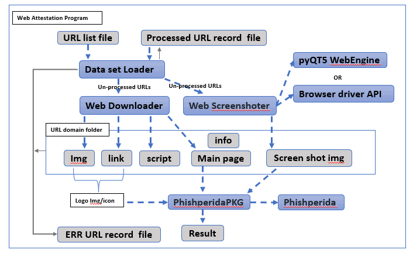

# WebAttestation
[TOC]

### Introduction 

We want to check several batch of web URLs (1~100 K) and find the phishing website/URL among them. This module is designed to do the URL/web attestation by using the API from NUS-Phishperida-Project. The program contents 3 main parts: WebDownloader, webScreenShoter and PhishperidaPKG. 

###### WebDownloader

This module will provide API to download the webpage component: html file, image file, javascript file, href link file based on the input URL. 

**Module detail doc** : https://github.com/LiuYuancheng/WebAttestation/blob/main/WebDownloadReadme.md

###### WebScreenShoter

This module will use different web browser's driver to capture the webpage's screen shot based on the given URL.

**Module detail doc** :

###### PhishperidaPKG

This module is used to encapsulate the NUS-Phishperida project (not OOP) as a black box API for other projects to use.

NUS-Phishperida project: https://github.com/lindsey98/Phishpedia

**Module detail doc** :


For each URL, the program will do below steps:

1. Use webDownloader module to download all the web components.1
2. Use webScreenShoter module to get a webpage screenshot of the url.

3. Pass the web components and the screen shot to PhishperidaPKG to do the siamese checking


###### Program Workflow

If you set the program running under single thread, the program work flow diagram will be shown as below: 




------

#### Program Setup

###### Development Environment : python 3.7.10

###### Additional Lib/Software Need

- **WebDownloader**:   Refer to program setup section in [***WebDownloaderReadme.md***]
- **WebScreenShoter**:  Refer to program setup section in [***WebScreenShoterReadme.md***]
- **PhishperidaPKG:** Refer to program setup section in [***PhishperidaPKGReadme.md***]

###### Hardware Needed

- **WebDownloader**:   N.A
- **WebScreenShoter**:  Computer with video output.
- **PhishperidaPKG:** Computer with Nvidia graph card. 

###### Program File List 

version: v0.1

| Program File           | Execution Env | Description                                                  |
| ---------------------- | ------------- | ------------------------------------------------------------ |
| src/webAttestation.py  | python 3.7.4  | Main web Attestation execution program.                      |
| src/webScreenShoter.py | python 3.7.10 | Main web screen shot  execution program.                     |
| src/webDownload.py     | python 3.7.10 | Main web Downloader program API.                             |
| src/phishpediaPKG.py   | python 3.8.10 | Encapsulated API the NUS-Phishperida project for OPP.        |
| src/webGlobal.py       | python 3.7.4  | Global parameters file which will be used in the other modules. |
| src/urllist.txt        |               | url record list.                                             |


------

#### Program Usage

###### Module API Usage

- **WebDownloader**:   Refer to program API usage section in [***WebDownloaderReadme.md***]
- **WebScreenShoter**:  Refer to program API usage section in [***WebScreenShoterReadme.md***]
- **PhishperidaPKG:** Refer to program API usage section in [***PhishperidaPKGReadme.md***]

###### Program Execution 

1. Copy the url you want to check in the url record file "***urllist.txt***"

2. Cd to the program folder and run program execution cmd: 

   ```
   python webAttestation.py
   ```

3. Check the result: 

 

------

> Last edit by LiuYuancheng(liu_yuan_cheng@hotmail.com) at 26/11/2021
