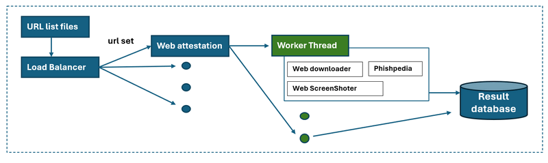

# Python Web Attestation Tool
**Program Design Purpose**: We want to create a automated tool to download the web contents from a URL and do screen shot of the web page, then fill all the data to the Phishperida program to  check several batch of web URLs (1~10K) and find the phishing website/URL among them. The program workflow is depicted below:


The project will use the [NUS-Phishperida project](https://github.com/lindsey98/Phishpedia) developed by Prof Yun Lin and Ruofan Liu to do the phishing website identification,  [Py_Web_Screenshot_Capture_Tool](https://github.com/LiuYuancheng/Py_Web_Screenshot_Capture_Tool) and [Py_Web_Contents_Download_Tool](https://github.com/LiuYuancheng/Py_Web_Contents_Download_Tool) to do the web contents automated archiving. 

```
# Created:     2021/11/25
# Version:     v_0.1.2
# Copyright:   Copyright (c) 2024 LiuYuancheng
# License:     MIT License 
```

**Table of Contents**

[TOC]

------

### Introduction 

This module is designed to do the URL/web attestation by using the API from NUS-Phishperida-Project. The program contents four main modules: 

- DatasetLoader: load the urls data set from batches of config files and filtered the processed urls. 
- WebDownloader: Download the contents from the target url and archive. 
- webScreenShoter: Do screen shot of the web page. 
- PhishperidaPKG : A wrapper module to call the Phishperida lib and record the verification result.

For each URL, the program will do below steps:

1. Use webDownloader module to download all the web components.1
2. Use webScreenShoter module to get a webpage screenshot of the url.

3. Pass the web components and the screen shot to PhishperidaPKG to do the siamese checking


##### DatasetLoader Module 

This module is used to load the URLs data from the URL list, record the processed URLs and error URLs. If the program/thread crashed, the program will continuous its task after restarting: the processed url will be ingored, then it will remove the corrupted file and continuous with not processed URLs 

##### WebDownloader Module 

The module used for  facilitate the scraping and downloading of all components associated with multiple batches of webpages, including `.html` files, `.css` stylesheets, `images`, `XML` files, `videos`, `JavaScript` files, and host `SSL certificates`, based on a provided list of URLs. The program workflow is depicted below:


> For the detail, please refer to the lib module :  [Py_Web_Contents_Download_Tool](https://github.com/LiuYuancheng/Py_Web_Contents_Download_Tool)


##### WebScreenShoter Module 

This module will use two different web drivers, Selenium Google Chrome Driver and QT5 Web Engine, to capture webpage screenshots.  The program workflow is depicted below:


> For the detail, please refer to the lib module : [Py_Web_Screenshot_Capture_Tool](https://github.com/LiuYuancheng/Py_Web_Screenshot_Capture_Tool)


##### PhishperidaPKG Module 

This module is used to encapsulate the NUS-Phishperida project (not OOP) as a black box API for other projects to use.

NUS-Phishperida project: https://github.com/lindsey98/Phishpedia

**Module detail doc** :https://github.com/LiuYuancheng/WebAttestation/blob/main/PhishpediaReadme.md


------

#### Program Setup

###### Development Environment : python 3.7.10

###### Additional Lib/Software Need

- **WebDownloader**:   Refer to program setup section in [***`WebDownloaderReadme.md`***]
- **WebScreenShoter**:  Refer to program setup section in [***`WebScreenShoterReadme.md`***]
- **PhishperidaPKG:** Refer to program setup section in [***`PhishperidaPKGReadme.md`***]

###### Hardware Needed

- **WebDownloader**:   N.A
- **WebScreenShoter**:  [optional] Computer with video output.
- **PhishperidaPKG:** [optional] Computer with Nvidia graph card. 

###### Program File List 

version: v0.1

| Program File           | Execution Env | Description                                                  |
| ---------------------- | ------------- | ------------------------------------------------------------ |
| src/webAttestation.py  | python 3.7.4  | Main web Attestation execution program.                      |
| src/webScreenShoter.py | python 3.7.10 | Web screen shot  module.                                     |
| src/webDownload.py     | python 3.7.10 | Web components download module.                              |
| src/phishpediaPKG.py   | python 3.8.10 | Encapsulated API the NUS-Phishperida project for OPP.        |
| src/webGlobal.py       | python 3.7.4  | Global parameters file which will be used in the other modules. |
| src/ConfigLoader       | python 3.7.4  | Data set loader module.                                      |
| src/urllist.txt        |               | URLs record list (url need to process).                      |
| resultPcdurl.txt       |               | Successful processed URLs list.                              |
| resultErrurl.txt       |               | Failed proessed URLs list.                                   |


------

#### Program Usage

###### Module API Usage

- **WebDownloader**:   Refer to program API usage section in [***`WebDownloaderReadme.md`***]
- **WebScreenShoter**:  Refer to program API usage section in [***`WebScreenShoterReadme.md`***]
- **PhishperidaPKG:** Refer to program API usage section in [***`PhishperidaPKGReadme.md`***]

###### Program Execution 

1. Copy the url you want to check in the url record file "***urllist.txt***"

2. Cd to the program folder and run program execution cmd: 

   ```
   python webAttestation.py
   ```

3. Check the process result in file: `resultPcdurl.txt` and `resultErrurl.txt`

######  MultiThread Design

Use mutli thread with background execution controller , multithread execution, task balancer




------

#### Reference 

- https://sites.google.com/view/phishpedia-site/home?authuser=0


------

> Last edit by LiuYuancheng(liu_yuan_cheng@hotmail.com) at 03/12/2021
