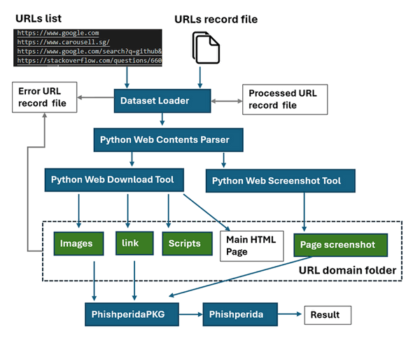

# Python Web Attestation Tool
**Program Design Purpose**: We want to create a automated tool to check several batches of web URLs (ranging from 1 to 10,000) and identify phishing websites/URLs among them. The program will download the web contents from a given URL list, then capture the screenshots of the webpage, and feed all the data into the Phishperida program. The program workflow is depicted below:



The project will leverage the [NUS-Phishperida project](https://github.com/lindsey98/Phishpedia), developed by Prof. Yun Lin and Ruofan Liu, for phishing website identification. Additionally, it will utilize [Py_Web_Screenshot_Capture_Tool](https://github.com/LiuYuancheng/Py_Web_Screenshot_Capture_Tool) and [Py_Web_Contents_Download_Tool](https://github.com/LiuYuancheng/Py_Web_Contents_Download_Tool) for automated web content archiving.

```
# Created:     2021/11/25
# Version:     v_0.1.2
# Copyright:   Copyright (c) 2024 LiuYuancheng
# License:     MIT License 
```

**Table of Contents**

[TOC]

- [Python Web Attestation Tool](#python-web-attestation-tool)
    + [Introduction](#introduction)
      - [DatasetLoader Module](#datasetloader-module)
      - [WebDownloader Module](#webdownloader-module)
      - [WebScreenShoter Module](#webscreenshoter-module)
      - [PhishperidaPKG Module](#phishperidapkg-module)
      - [Program Setup](#program-setup)
        * [Development Environment : python 3.7.10](#development-environment---python-3710)
        * [Additional Lib/Software Need](#additional-lib-software-need)
        * [Hardware Needed](#hardware-needed)
        * [Program File List](#program-file-list)
    + [Program Usage](#program-usage)
      - [Module API Usage](#module-api-usage)
      
      - [Program Execution](#program-execution)
      
      - [Multi-Threading Design](#multi-threading-design)
      
      - [Reference](#reference)
      
        

------

### Introduction 

This module is crafted for URL/web attestation using the API provided by the NUS-Phishperida-Project. It encompasses four main modules:

- **DatasetLoader**: Responsible for loading URL datasets from configuration files in batches and filtering processed URLs.
- **WebDownloader**: Facilitates the scraping and downloading of webpage components.
- **WebScreenShoter**: Captures webpage screenshots.
- **PhishperidaPKG**: A wrapper module to invoke the Phishperida library and record verification results.

For each URL, the program undergoes the following steps:

1. Utilizes the `WebDownloader` module to download all webpage components.
2. Employs the `webScreenShoter` module to capture a webpage screenshot.
3. Passes the webpage components and screenshot to `PhishperidaPKG` for siamese checking.


#### DatasetLoader Module 

This module loads URLs data from the URL list, recording processed URLs and error URLs. In case of program/thread crashes, it resumes its task upon restart, ignoring processed URLs and removing corrupted files before continuing with unprocessed URLs.

#### WebDownloader Module 

The module used for  facilitate the scraping and downloading of all components associated with multiple batches of webpages, including `.html` files, `.css` stylesheets, `images`, `XML` files, `videos`, `JavaScript` files, and host `SSL certificates`, based on a provided list of URLs. The program workflow is depicted below:


> For the detail, please refer to the lib module :  [Py_Web_Contents_Download_Tool](https://github.com/LiuYuancheng/Py_Web_Contents_Download_Tool)

#### WebScreenShoter Module 

This module will use two different web drivers, Selenium Google Chrome Driver and QT5 Web Engine, to capture webpage screenshots.  The program workflow is depicted below:


> For the detail, please refer to the lib module : [Py_Web_Screenshot_Capture_Tool](https://github.com/LiuYuancheng/Py_Web_Screenshot_Capture_Tool)

#### PhishperidaPKG Module 

This module is used to encapsulate the NUS-Phishperida project (not OOP) as a black box API for other projects to use.

NUS-Phishperida project Github Repo link : https://github.com/lindsey98/Phishpedia

>  For the detail usage, please refer to d the [PhishperidaPKG doc](https://github.com/LiuYuancheng/WebAttestation/blob/main/PhishpediaReadme.md)


------

#### Program Setup

##### Development Environment : python 3.7.10

##### Additional Lib/Software Need

- **WebDownloader**:   Refer to program setup section in [WebDownloaderReadme.md](https://github.com/LiuYuancheng/Py_Web_Contents_Download_Tool)
- **WebScreenShoter**:  Refer to program setup section in [WebScreenShoterReadme.md](https://github.com/LiuYuancheng/Py_Web_Screenshot_Capture_Tool)
- **PhishperidaPKG:** Refer to program setup section in [PhishperidaPKGReadme.md](PhishpediaReadme.md)

##### Hardware Needed

- **WebDownloader**:   N.A
- **WebScreenShoter**:  [optional] Computer with video output.
- **PhishperidaPKG:** [optional] Computer with Nvidia graph card. 

##### Program File List 

| Program File           | Execution Env | Description                                                  |
| ---------------------- | ------------- | ------------------------------------------------------------ |
| src/webAttestation.py  | python 3.7.4  | Main web Attestation execution program.                      |
| src/webScreenShoter.py | python 3.7.10 | Web screen shot  module.                                     |
| src/webDownload.py     | python 3.7.10 | Web components download module.                              |
| src/phishpediaPKG.py   | python 3.8.10 | Encapsulated API the NUS-Phishperida project for OPP.        |
| src/webGlobal.py       | python 3.7.4  | Global parameters file which will be used in the other modules. |
| src/ConfigLoader       | python 3.7.4  | Data set loader module.                                      |
| src/urllist.txt        |               | URLs record list (url need to process).                      |
| resultPcdurl.txt       |               | Successful processed URLs list.                              |
| resultErrurl.txt       |               | Failed processed URLs list.                                  |


------

### Program Usage


#### Module API Usage

- **WebDownloader**:   Refer to program API document [WebDownloader_API_Doc.html](https://github.com/LiuYuancheng/Py_Web_Contents_Download_Tool/blob/master/Lib_api_doc.html.html)
- **WebScreenShoter**:  Refer to program API usage section in [WebScreenShoter_API_Doc.html](https://github.com/LiuYuancheng/Py_Web_Screenshot_Capture_Tool/blob/master/Lib_api_doc.html)
- **PhishperidaPKG:** Refer to program API usage section in [PhishperidaPKGReadme.md](PhishpediaReadme.md)


#### Program Execution 

1. Copy the url you want to check in the url record file "***urllist.txt***"

2. Cd to the program folder and run program execution cmd: 

   ```
   python webAttestation.py
   ```

3. Check the process result in file: `resultPcdurl.txt` and `resultErrurl.txt`

####  Multi-Threading Design

Use multi-thread with background execution controller , multithread execution, task balancer: 


------

#### Reference 

- https://sites.google.com/view/phishpedia-site/home?authuser=0


------

> Last edit by LiuYuancheng([liu_yuan_cheng@hotmail.com](mailto:liu_yuan_cheng@hotmail.com)) at 04/05/2024, if you have any problem, please send me a message.
