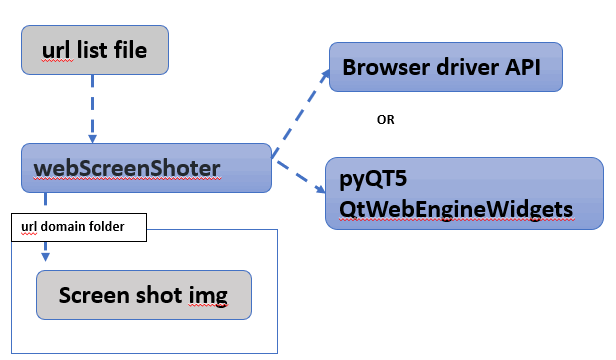

# Web ScreenShoter


#### Introduction

This module will use different web browser's driver or Qt5 lib QtWebEngineWidgets to capture the part or the whole webpage's screen shot based on the given URL. The user can select the related lib he want to use to capture the webpage during the object init by passing in the "type" parameter. 

To prosses multiple URLs at the same time, The user can list all the url he wants to download  in the file "urllist.txt" as shown below: 

```
# Add the URL you want to download line by line(The url must start with 'http' or 'https' ):
# example: https://www.google.com
https://www.google.com
https://www.carousell.sg/
https://www.google.com/search?q=github&sxsrf=AOaemvJh3t5_h8H85AE8Ajbb1IMnBrRISA%3A1636698503535&source=hp&ei=hwmOYY6mHdGkqtsPq8S9sAY&iflsig=ALs-wAMAAAAAYY4Xl7GLWS16_xc2Q9XrG0p3q277DpkL&oq=&gs_lcp=Cgdnd3Mtd2l6EAEYADIHCCMQ6gIQJzIHCCMQ6gIQJzIHCCMQ6gIQJzIHCCMQ6gIQJzIHCCMQ6gIQJzIHCCMQ6gIQJzINCC4QxwEQowIQ6gIQJzIHCCMQ6gIQJzIHCCMQ6gIQJzIHCCMQ6gIQJ1AAWABgjgdoAXAAeACAAQCIAQCSAQCYAQCwAQo&sclient=gws-wiz
https://stackoverflow.com/questions/66022042/how-to-let-kubernetes-pod-run-a-local-script/66025424
```

###### Program Workflow



Version: v_0.2


------

#### Program Setup

###### Development Environment : python 3.7.4

###### Additional Lib/Software Need

1. **selenium**

   install: https://selenium-python.readthedocs.io/

   ```
   pip install selenium
   ```

2. **pyQT5** and **pyQT5-PyQtWebEngine**

   ```
   pip install PyQt5
   pip install PyQtWebEngine
   ```

3. 

###### Hardware Needed : None

###### Program File List 

version: v0.2

| Program File       | Execution Env | Description                          |
| ------------------ | ------------- | ------------------------------------ |
| webScreenShoter.py | python 3      | Main executable program use the API. |
| urllist.txt        |               | url record list.                     |


------

#### Program Usage

###### Module API Usage

1. WebCreen Captuer : 

```
obj = webScreenShoter(browserMD=False)
```

- **browserMD**: Set to "True" to capture the web screenshot with browser , set to "False" to capture the web screen shot with pyQT5-webEngine.

2. Call API method savePage to scape url and save the data in a folder 

   ```
   obj.getScreenShot('<url>', '<folder_name>')
   
   # Exampe:
   obj.getScreenShot('https://www.google.com', 'www_google_com')
   ```

3. 


###### Program Execution 

1. Copy the url you want to check in the url record file "**urllist.txt**"

2. Cd to the program folder and run program execution cmd: 

   ```
   python webScreenShoter.py
   ```

3. Check the result: 

   For example, if you copy the url "https://www.carousell.sg/" as the first url you want to check into the file "urllist.txt" file, the screenshot file **shot.png** will be save under folder "1_www.carousell.sg_files"


------

#### Problem and Solution

**Format:** 

**Problem**: (Situation description)

**OS Platform** :

**Error Message**:

**Type**: Setup exception

**Solution**:

**Related Reference**:


------

> Last edit by LiuYuancheng(liu_yuan_cheng@hotmail.com) at 30/11/2021

